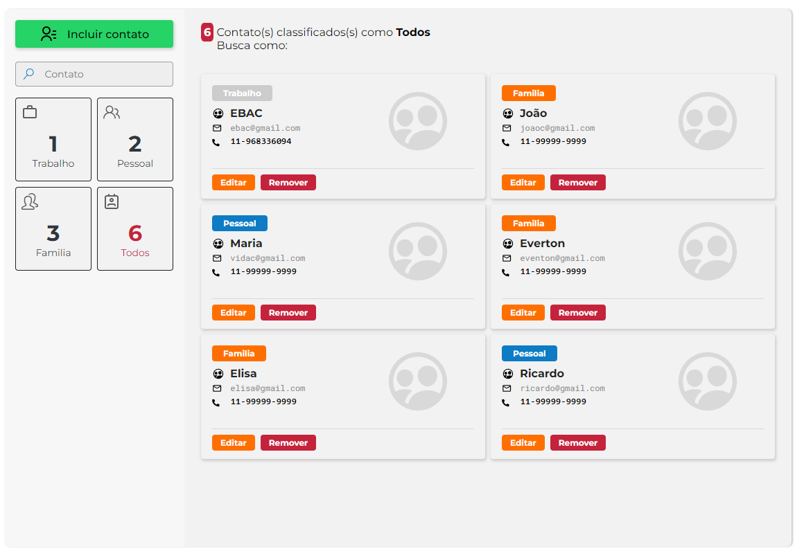
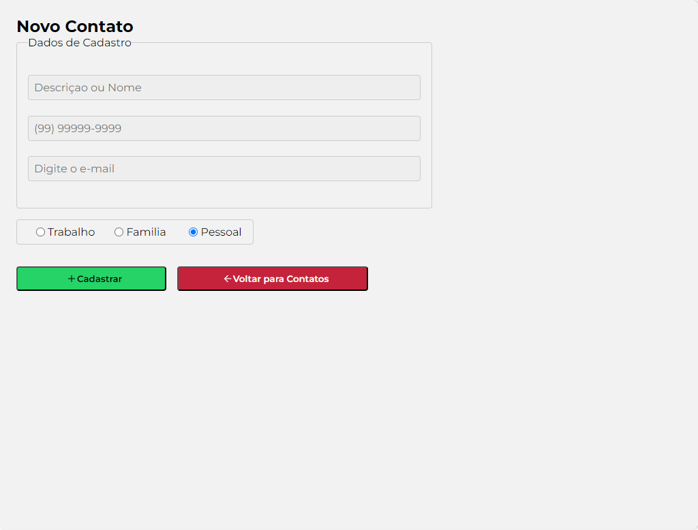

<!-- Titulo do Projeto -->

# ✨Contact-List

<!-- Badges do Projeto -->


<!-- Menu -->

## Table of Contents

- [Project description](#project-description)
  - [Functionalities](#functionalities)
- [Setup](#setup)
  - [Prerequisites](#prerequisites)
  - [technologies and tools](#technologies-and-tools)
- [Instalation](#instalation)
- [Usage](#usage)
- [Update](#update)
- [References](#references)
- [Contributors or owners](#contributors-or-owners)
  - [Contribute-to-the-projects](#contribute-to-the-projects)
- [Contact](#contact)
- [License](#license)

<!-- Descriçào do Projeto -->

## Project Description

Esse Projeto foi desenvolvido para a pratíca de tecnologias, como `typescript` , `styled-components`, `redux@toolkit`.<br>
Minha fonte de motivação deste projeto foi a [EBAC](https://ebaconline.com.br/). <br>
O **Contact-List** é uma aplicação de gerenciamento de Lista de contatos. <br>

`Task`

- Desenvolver uma aplicação minimalista de um Gerenciador de listas de Contatos usando **@redux/toolkit**

`Charlenge`

Os Maiores desafios foram:<br>
Colocar em pratíca o que foi aprendido no curso, da **EBAC** criando um aplicação simples porem funcional.

### Functionalities

- [x] **Criar um card de contatos**
- [x] **Editar os dados inseridos no Card**
- [x] **Busca po Filtro de Pesquisa, onde o usuário pode pesquisar pelo nome ou pela Categoria como: `Famila`, `Pessoal` ou `Trabalho`**<br>

> [!TIP]
>
> Baixe o Projeto em seu Computador e veja como ficou.

<!-- Setup do Projeto -->

## Setup

Requisitos necessários para rodar o projeto:<br>

### Prerequisites

>

`Node.js` `VSCode` `Git`

> [!IMPORTANT]
>
> - Run Time [Node.js](https://nodejs.org/en/) com a versão _16 ou superior_.<br>
> - Um editor de códigos onde eu recomendo o [VCode](https://code.visualstudio.com/)<br>
> - E o [git](https://git-scm.com/downloads) uma aplicação de versionamento de código.

<!-- > - Extensão do VSCode [**Live Server**](https://marketplace.visualstudio.com/items?itemName=ritwickdey.LiveServer) -->

### technologies and tools

`React` `Vite` `styled-components` `redux` `redux@toolkit` `EditorConfig` `ESLint` `Git`
`Prettier` `Pnpm`

<!-- Bagde dos Repositórios, Node.js Git e Vscode -->
<!-- 

 -->

## Instalation

Para rodar o projeto em seu computador você tera que fazer o [fork](https://docs.github.com/pt/pull-requests/collaborating-with-pull-requests/working-with-forks/fork-a-repo) do repositório. Caso você não saiba como fazer, estou deixando um **link** da documentação oficial do gitHub, onde é esclarecido como fazer essse processo.<br> Fazendo esse processo você tera uma copia desse Repositório no seu GitHub.
<br>

<a href="https://docs.github.com/pt/pull-requests/collaborating-with-pull-requests/working-with-forks/fork-a-repo"></a>

Depois de ter feito o **fork** vamos fazer o [clone](https://docs.github.com/pt/repositories/creating-and-managing-repositories/cloning-a-repository) desse Repositório atráves do **VSCode**. </br>
Caso você não saiba como fazer, estou deixando um link para a documentação oficial do gitHub onde é esclarecido como fazer essse processo.
<br>
<sub>Command Line</sub>

```bash
git clone https://github.com/sezimarjr/contact-list
```


<a href="https://docs.github.com/pt/repositories/creating-and-managing-repositories/cloning-a-repository"></a>

Com o **VSCode** aberto, abra o **terminal**. pelo **VsCode** e vamos fazer a instalação das dependências necessárias para a execução do Projeto:

**1. Instalando as dependências**<br>

 <details open>

<summary>Gerenciador de pacotes usado</summary>

**npm**

</sdetais>

<sub>Command Line</sub>

```bash
npm  i
```

<br>

## Usage

**2. Inicie o Servidor com o seguinte comando dentro do Terminal**<br>

<details open>

<summary>Gerenciador de pacotes usado</summary>

**npm**

</sdetais>

<sub>Command Line</sub>

```bash
npm run dev
```

</br>

> Ira aparecer um Pop-up solicitanto que você clique para acessar o projeto no seu navegador.
> Segure a tecla <strong> Control </strong> e clique no local específicado, o projeto será aberto em uma nova aba do seu nagevador Preferido.

<br>
 <!-- Imagem de Demostração -->
<h3 align="center"> Imagem de demostração do Projeto</h3>

</br>
</br>




<

<br>
 <div align="center">
Acesse a versão on-line Projeto clicando no Link Abaixo
<br>
<br>
<a href="https://contac-list-emmanuel-oliveira-rl9alou8g.vercel.app/">
</a>

</div>
<br>

## Update

<br>

> Nessa seção teremos as atualizações do Projeto:

## References

**Acesse:** [EBAC](https://ebaconline.com.br/)
